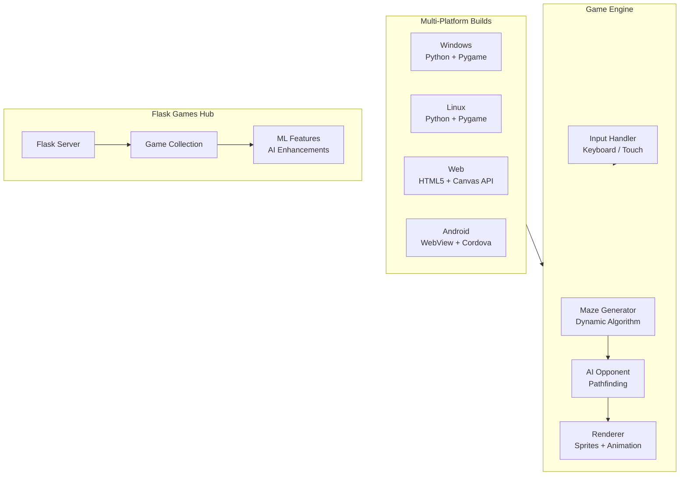

# mind_games 🎮🧩

[](https://github.com/krishnakumarbhat/mind_games/actions/workflows/ci.yml)
[](https://python.org)
[]()

A collection of **AI-powered games** including a Mario-themed maze game where you race against an AI opponent, plus a Flask-based games hub with ML-enhanced features. Multi-platform: Windows, Linux, Web, and Android.

## 🏗️ Architecture



## 🎯 Games Included

### Mario Maze Game

- **Player vs AI** — Race against an intelligent AI opponent
- **Dynamic Mazes** — Each game creates a unique maze
- **Mario Theme** — Classic Mario-style graphics and colors

### Flask Games Hub

- Web-based game collection served via Flask
- ML-enhanced game features
- Responsive web interface

## 🛠️ Tech Stack

| Platform            | Technology                           |
| ------------------- | ------------------------------------ |
| Desktop (Win/Linux) | Python 3.7+, Pygame                  |
| Web                 | HTML5, CSS3, JavaScript (Canvas API) |
| Android             | WebView + Cordova                    |
| Games Hub           | Flask, Python                        |
| AI                  | Pathfinding algorithms, ML features  |

## 🚀 Quick Start

### Desktop (Linux)

```bash
cd linux
pip3 install -r requirements.txt
python3 mario_maze.py
```

### Desktop (Windows)

```bash
cd windows
pip install -r requirements.txt
python mario_maze.py
```

### Web

```bash
cd web
python -m http.server 8000
# Open http://localhost:8000
```

### Flask Games Hub

```bash
cd flask_games_hub
pip install -r requirements.txt
python app.py
```

## 🎮 Controls

| Platform | Controls           |
| -------- | ------------------ |
| Desktop  | Arrow keys         |
| Web      | Arrow keys or WASD |
| Android  | Touch controls     |

**Objective:** Navigate through the maze and reach the green goal before the AI does!

## 📁 Project Structure

```
mind_games/
├── windows/               # Windows desktop version
├── linux/                 # Linux desktop version
├── web/                   # HTML5 web version
├── android/               # Android WebView app
├── flask_games_hub/       # Flask-based games collection
│   ├── app.py             # Flask server
│   ├── games/             # Individual game modules
│   ├── templates/         # HTML templates
│   └── static/            # CSS, JS, assets
├── doom_game/             # Doom-style game experiment
├── .github/workflows/     # CI/CD pipeline
├── .gitignore
└── README.md
```

## 📝 License

MIT License

## 🤝 Contributing

1. Fork the repository
2. Create a feature branch: `git checkout -b feature-name`
3. Commit your changes: `git commit -m 'Add feature'`
4. Push to the branch: `git push origin feature-name`
5. Open a pull request
